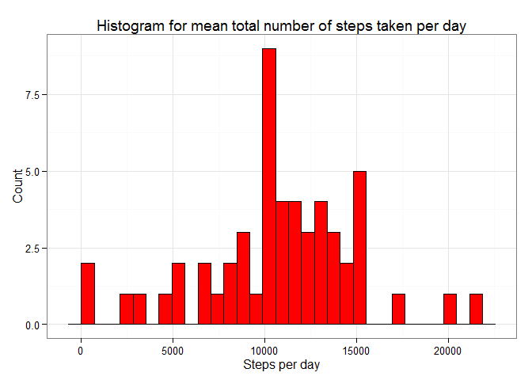
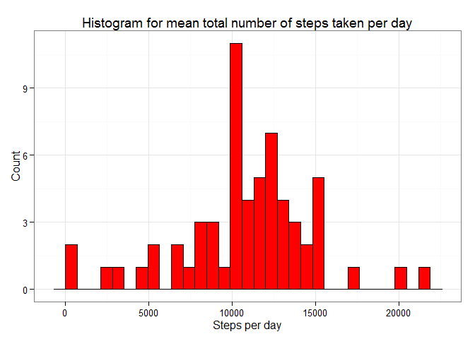
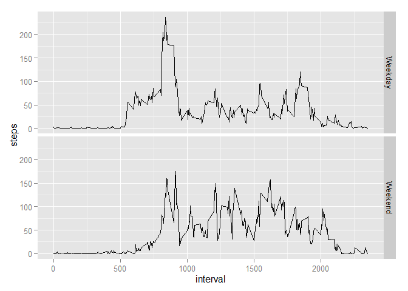

# Reproducible Research: Peer Assessment 1


## Loading and preprocessing the data

```r
if (!file.exists("activity.csv")) unzip("activity.zip")
data <- read.csv("activity.csv")

# Take a look at the data
head(data)
```

```
##   steps       date interval
## 1    NA 2012-10-01        0
## 2    NA 2012-10-01        5
## 3    NA 2012-10-01       10
## 4    NA 2012-10-01       15
## 5    NA 2012-10-01       20
## 6    NA 2012-10-01       25
```

```r
summary(data)
```

```
##      steps                date          interval     
##  Min.   :  0.00   2012-10-01:  288   Min.   :   0.0  
##  1st Qu.:  0.00   2012-10-02:  288   1st Qu.: 588.8  
##  Median :  0.00   2012-10-03:  288   Median :1177.5  
##  Mean   : 37.38   2012-10-04:  288   Mean   :1177.5  
##  3rd Qu.: 12.00   2012-10-05:  288   3rd Qu.:1766.2  
##  Max.   :806.00   2012-10-06:  288   Max.   :2355.0  
##  NA's   :2304     (Other)   :15840
```

```r
# Turn dates into Date
data$date <- as.Date(data$date)
```

## What is mean total number of steps taken per day?

```r
# 1. Calculate the total number of steps taken per day
daysteps <- aggregate(data$steps, by = list(data$date), FUN = sum)
colnames(daysteps) <- c("Date", "Steps")
head(daysteps, 14)
```

```
##          Date Steps
## 1  2012-10-01    NA
## 2  2012-10-02   126
## 3  2012-10-03 11352
## 4  2012-10-04 12116
## 5  2012-10-05 13294
## 6  2012-10-06 15420
## 7  2012-10-07 11015
## 8  2012-10-08    NA
## 9  2012-10-09 12811
## 10 2012-10-10  9900
## 11 2012-10-11 10304
## 12 2012-10-12 17382
## 13 2012-10-13 12426
## 14 2012-10-14 15098
```


```r
# 2. Make a histogram of the total number of steps taken each day
library(ggplot2)
m <- ggplot(daysteps, aes(x = Steps))
m + geom_histogram(fill = "red", col = "black") + 
    theme_bw() +
    labs(title = "Histogram for mean total number of steps taken per day") +
    labs(x = "Steps per day", y = "Count")
```

 


```r
# 3. Calculate and report the mean and median of the total number of steps taken per day
meansteps <- mean(daysteps$Steps, na.rm = TRUE)
meansteps
```

```
## [1] 10766.19
```

```r
mediansteps <- median(daysteps$Steps, na.rm = TRUE)
mediansteps
```

```
## [1] 10765
```

## What is the average daily activity pattern?

```r
# 1. Make a time series plot (i.e. type = "l") of the 5-minute interval (x-axis) and the average number of steps taken, averaged across all days (y-axis)
intervalsteps <- aggregate(data$steps, by = list(data$interval), FUN = mean, na.rm=TRUE)
colnames(intervalsteps) <- c("Interval", "Steps")
plot(intervalsteps, type = "l")
```

 

## Imputing missing values

```r
# 1. Calculate and report the total number of missing values in the dataset 
countna <- sum(is.na(data))
print(paste0("There are ", countna, " missing values (NAs) in the dataset"))
```

```
## [1] "There are 2304 missing values (NAs) in the dataset"
```


```r
# 2. Devise a strategy for filling in all of the missing values in the dataset
data$weekday <- format(data$date, format = "%A")
dayinterval <- aggregate(data$steps, by = list(data$interval, data$weekday), FUN = mean, na.rm=TRUE)
colnames(dayinterval) <- c("interval", "weekday", "meansteps")
newdata <- merge(data, dayinterval, by = c("interval", "weekday"))
newdata <- newdata[order(newdata$date, newdata$interval), ]

# 3. Create a new dataset that is equal to the original dataset but with the missing data filled in
newdata$steps[is.na(newdata$steps)] <- newdata$meansteps[is.na(newdata$steps)]
newdata <- newdata[, c("steps", "date", "interval")]
```


```r
# 4. Make a histogram of the total number of steps taken each day 
newdaysteps <- aggregate(newdata$steps, by = list(newdata$date), FUN = sum)
colnames(newdaysteps) <- c("Date", "Steps")

library(ggplot2)
m <- ggplot(newdaysteps, aes(x = Steps))
m + geom_histogram(fill = "red", col = "black") + 
    theme_bw() +
    labs(title = "Histogram for mean total number of steps taken per day") +
    labs(x = "Steps per day", y = "Count")
```

 

```r
# Calculate and report the mean and median total number of steps taken per day.
newmeansteps <- mean(newdaysteps$Steps, na.rm = TRUE)
newmeansteps
```

```
## [1] 10821.21
```

```r
newmediansteps <- median(newdaysteps$Steps, na.rm = TRUE)
newmediansteps
```

```
## [1] 11015
```

```r
#Do these values differ from the estimates from the first part of the assignment?
print(paste0("The mean of ", newmeansteps, " is ", newmeansteps - meansteps, " higher than the old dataset"))
```

```
## [1] "The mean of 10821.2096018735 is 55.0209226282532 higher than the old dataset"
```

```r
print(paste0("The median of ", newmediansteps, " is ", newmediansteps - mediansteps, " higher than the old dataset"))
```

```
## [1] "The median of 11015 is 250 higher than the old dataset"
```

```r
# It seems that inputting missing data results in higher frequencies on the histogram as well as higher values
```

## Are there differences in activity patterns between weekdays and weekends?

```r
# 1. Create a new factor variable in the dataset with two levels - "weekday" and "weekend" indicating whether a given date is a weekday or weekend day.
weekend <- function(day) {
  if (day %in% c("Saturday", "Sunday")) {
    "Weekend"
  } else {
    "Weekday"
  }
}

newdata$weekday <- format(newdata$date, format = "%A")
newdata$daytype <- as.factor(sapply(newdata$weekday, weekend))

weekenddata <- aggregate(newdata$steps, by = list(newdata$daytype, newdata$interval), FUN = mean)
colnames(weekenddata) <- c("daytype", "interval", "steps")

m <- ggplot(weekenddata, aes(interval, steps))
m + facet_grid(daytype ~ .) +
    geom_line()
```

 
