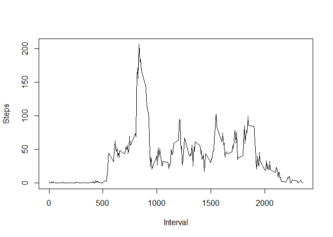

# Reproducible Research: Peer Assessment 1


## Loading and preprocessing the data

```r
if (!file.exists("activity.csv")) unzip("activity.zip")
data <- read.csv("activity.csv")

# Take a look at the data
head(data)
```

```
##   steps       date interval
## 1    NA 2012-10-01        0
## 2    NA 2012-10-01        5
## 3    NA 2012-10-01       10
## 4    NA 2012-10-01       15
## 5    NA 2012-10-01       20
## 6    NA 2012-10-01       25
```

```r
tail(data)
```

```
##       steps       date interval
## 17563    NA 2012-11-30     2330
## 17564    NA 2012-11-30     2335
## 17565    NA 2012-11-30     2340
## 17566    NA 2012-11-30     2345
## 17567    NA 2012-11-30     2350
## 17568    NA 2012-11-30     2355
```

```r
summary(data)
```

```
##      steps                date          interval     
##  Min.   :  0.00   2012-10-01:  288   Min.   :   0.0  
##  1st Qu.:  0.00   2012-10-02:  288   1st Qu.: 588.8  
##  Median :  0.00   2012-10-03:  288   Median :1177.5  
##  Mean   : 37.38   2012-10-04:  288   Mean   :1177.5  
##  3rd Qu.: 12.00   2012-10-05:  288   3rd Qu.:1766.2  
##  Max.   :806.00   2012-10-06:  288   Max.   :2355.0  
##  NA's   :2304     (Other)   :15840
```

```r
# Turn dates into Date and ad Weekday column
data$date <- as.Date(data$date)
data$weekday <- format(data$date, format = "%A")
```

## What is mean total number of steps taken per day?

```r
# 1. Calculate the total number of steps taken per day
daysteps <- aggregate(data$steps, by = list(data$date), FUN = sum)
colnames(daysteps) <- c("Date", "Steps")
```


```r
# 2. Make a histogram of the total number of steps taken each day
library(ggplot2)
m <- ggplot(daysteps, aes(x = Steps))
m + geom_histogram(fill = "red", col = "black") + 
    theme_bw() +
    labs(title = "Histogram for mean total number of steps taken per day") +
    labs(x = "Steps per day", y = "Count")
```

 


```r
# 3. Calculate and report the mean and median of the total number of steps taken per day
meansteps <- mean(daysteps$Steps, na.rm = TRUE)
meansteps
```

```
## [1] 10766.19
```

```r
mediansteps <- median(daysteps$Steps, na.rm = TRUE)
mediansteps
```

```
## [1] 10765
```

## What is the average daily activity pattern?

```r
# 1. Make a time series plot (i.e. type = "l") of the 5-minute interval (x-axis) and the average number of steps taken, averaged across all days (y-axis)
intervalsteps <- aggregate(data$steps, by = list(data$interval), FUN = mean, na.rm=TRUE)
colnames(intervalsteps) <- c("Interval", "Steps")
plot(intervalsteps, type = "l")
```

 

## Imputing missing values

```r
head(data)
```

```
##   steps       date interval weekday
## 1    NA 2012-10-01        0  Monday
## 2    NA 2012-10-01        5  Monday
## 3    NA 2012-10-01       10  Monday
## 4    NA 2012-10-01       15  Monday
## 5    NA 2012-10-01       20  Monday
## 6    NA 2012-10-01       25  Monday
```
#natest1 <- aggregate(data$steps, by = list(data$interval, data$weekday), FUN = mean, na.rm=TRUE)
#natest1b <- aggregate(natest1$Steps, by = list(natest1$Weekday), FUN = sum)
natest2 <- aggregate(data$steps, by = list(data$interval, data$weekday), FUN = mean, na.rm=TRUE)
colnames(natest1) <- c("Interval", "Weekday", "Steps")
colnames(natest2) <- c("Interval", "Weekday", "Steps")
library(ggplot2)
m <- ggplot(natest1, aes(x = Weekday))
m + geom_bar(fill = "red", col = "black") + 
    theme_bw() +
    labs(title = "Mean total number of steps per Interval per Day of the Week") +
    labs(x = "Steps per week day", y = "Count")

g <- ggplot(natest1, aes(Interval, Steps, color=factor(Weekday)))
g + geom_line()


## Are there differences in activity patterns between weekdays and weekends?
